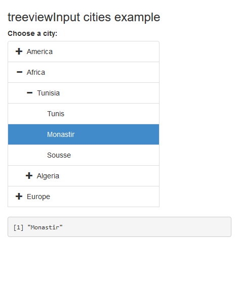

# shinytreeview

> Hierarchical tree structures input for Shiny applications. Interface for [bootstrap-treeview](https://github.com/patternfly/patternfly-bootstrap-treeview) JS library.

<!-- badges: start -->
[](https://www.tidyverse.org/lifecycle/#experimental)
<!-- badges: end -->


## Installation

Install the development version from GitHub with:

```r
remotes::install_github("dreamRs/shinytreeview")
```

## Example



```r
library(shiny)
library(shinytreeview)

data("cities")

ui <- fluidPage(
  tags$h3("treeviewInput cities example"),
  treeviewInput(
    inputId = "tree",
    label = "Choose a city:",
    choices = make_tree(cities, c("continent", "country", "city")),
    multiple = FALSE,
    prevent_unselect = TRUE
  ),
  verbatimTextOutput(outputId = "result")
)

server <- function(input, output, session) {
  output$result <- renderPrint({
    input$tree
  })
}

shinyApp(ui, server)
```

