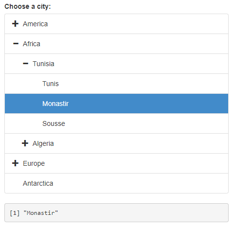
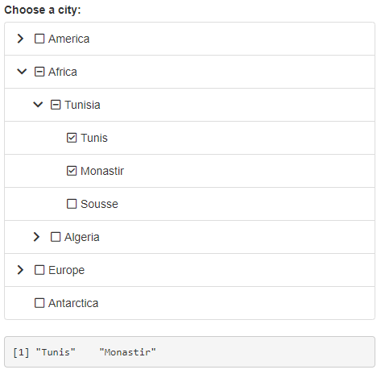

# shinytreeview

> Hierarchical tree structures input for Shiny applications. Interface for [bootstrap-treeview](https://github.com/patternfly/patternfly-bootstrap-treeview) JS library.

<!-- badges: start -->
[](https://www.tidyverse.org/lifecycle/#experimental)
[](https://github.com/dreamRs/shinytreeview/actions/workflows/R-CMD-check.yaml)
<!-- badges: end -->


## Installation

Install the development version from GitHub with:

```r
remotes::install_github("dreamRs/shinytreeview")
```

## Example

`treeviewInput()` allow to select a value (or several) in a hierarchical structure :



Code for this example:

```r
library(shiny)
library(shinytreeview)

data("cities")

ui <- fluidPage(
  tags$h3("treeviewInput cities example"),
  treeviewInput(
    inputId = "tree",
    label = "Choose a city:",
    choices = make_tree(
      cities, c("continent", "country", "city")
    ),
    multiple = FALSE,
    prevent_unselect = TRUE,
    width = "100%"
  ),
  verbatimTextOutput(outputId = "result")
)

server <- function(input, output, session) {
  output$result <- renderPrint({
    input$tree
  })
}

if (interactive())
  shinyApp(ui, server)
```


`treecheckInput()` allow to check a value (or several) in a hierarchical structure :



Code for this example:

```r
library(shiny)
library(shinytreeview)

data("cities")

ui <- fluidPage(
  tags$h3("treeviewInput cities example"),
  treecheckInput(
    inputId = "tree",
    label = "Choose a city:",
    choices = make_tree(
      cities, c("continent", "country", "city")
    ),
    width = "100%"
  ),
  verbatimTextOutput(outputId = "result")
)

server <- function(input, output, session) {
  output$result <- renderPrint({
    input$tree
  })
}

if (interactive())
  shinyApp(ui, server)
```


## Development

This package use [{packer}](https://github.com/JohnCoene/packer) to manage JavaScript assets, see packer's [documentation](https://packer.john-coene.com/#/) for more.

Install nodes modules with:

```r
packer::npm_install()
```

Modify `srcjs/inputs/treeview.js`, then run:

```r
packer::bundle()
```

Re-install R package and try demo applications in `examples/`.
